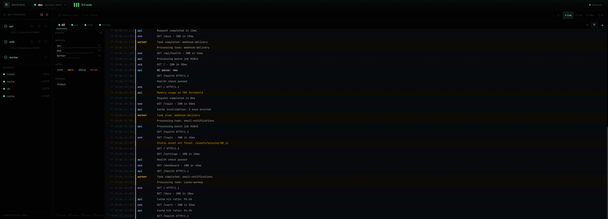
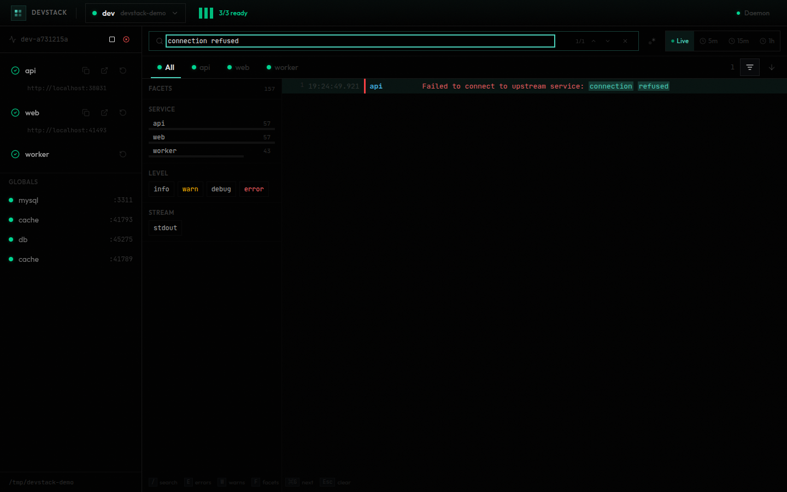
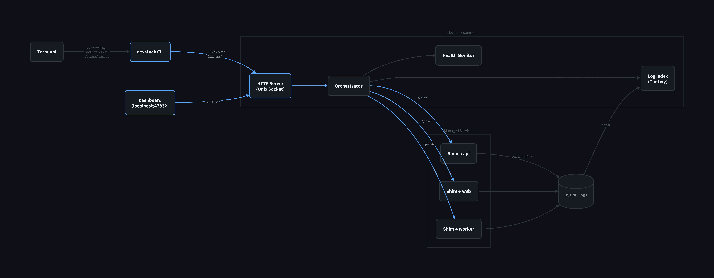

# devstack

Local development orchestration with automatic port allocation, structured logs, and file watching. Think docker-compose for local dev, but services never hardcode ports, dependencies start in order, and you get full-text search across all logs.



## Quick Start

**Recommended: Use the agent skill.** If you're working with an AI coding agent (Claude, etc.), give it the [`install-devstack`](skills/install-devstack/SKILL.md) skill. It walks through installation interactively — detects your platform, asks whether you want a prebuilt binary or source build, installs the daemon, verifies health, and sets up shell completions. After installation, the [`devstack`](skills/devstack/SKILL.md) skill teaches the agent how to create configs, manage stacks, query logs, and operate the full CLI.

**Manual install:**

Option 1 — Download prebuilt binary:

```bash
curl --proto '=https' --tlsv1.2 -LsSf https://github.com/robinwander/devstack/releases/latest/download/devstack-installer.sh | sh
```

Option 2 — Build from source (requires [Rust](https://rustup.rs/)):

```bash
git clone https://github.com/robinwander/devstack.git ~/tools/devstack
cd ~/tools/devstack
./scripts/install-cli.sh   # builds release binary to ~/.local/bin
```

Then install and start the daemon:

```bash
devstack install           # Linux: systemd user service; macOS: LaunchAgent
devstack doctor            # verify everything is working
```

Initialize a config and start your stack:

```bash
cd your-project
devstack init
devstack up
```

## Features

### Daemon-Managed Service Lifecycle

Services start in dependency order, restart automatically on failure, and are guaranteed cleanup. Linux uses systemd transient units with cgroup-scoped process trees — no orphan processes. macOS uses a LaunchAgent-managed daemon with process group signaling.

```bash
devstack up              # start the default stack
devstack up --force      # restart everything, even unchanged services
devstack status          # see what's running
devstack down            # graceful shutdown
```

### Automatic Port Allocation

The daemon picks free ports and injects them as environment variables. Services never hardcode ports and reference each other by name through templates:

```toml
[stacks.dev.services.api]
cmd = "pnpm api"
readiness = { http = { path = "/health" } }

[stacks.dev.services.web]
cmd = "pnpm dev"
deps = ["api"]

[stacks.dev.services.web.env]
VITE_API_URL = "{{ services.api.url }}"
```

Every service gets `DEV_PORT_<SERVICE>` and `DEV_URL_<SERVICE>` env vars. External tools (Playwright, scripts) can read the same values from the run manifest.

### Web Dashboard

A real-time web UI for monitoring runs, services, and logs. Open it with:

```bash
devstack ui
```

The dashboard provides:

- **Run overview** — switch between active runs, see per-service health at a glance
- **Service panel** — view status, copy URLs, open services in browser, restart individual services
- **Log viewer** — full-text search across all services with facet filtering, time range selection, auto-scroll, and virtualized rendering for large log volumes
- **Command palette** — press `⌘K` for quick access to all actions
- **Keyboard-driven** — `/` to search, `E`/`W` to filter errors/warnings, `F` for facets, number keys to switch tabs
- **Shareable URLs** — all view state (run, service, search, filters) is reflected in URL parameters

When no stacks are running, the dashboard shows registered projects with quick-start buttons.

You can also navigate the dashboard from the CLI or scripts — useful for sharing context with teammates or AI agents:

```bash
devstack show --service api --level error          # open dashboard filtered to api errors
devstack show --service worker --search "timeout"  # open dashboard with a search query
```

See [devstack-dash/README.md](devstack-dash/README.md) for full dashboard documentation.

### Agent Integration

`devstack agent` wraps any CLI (shell, AI coding agent, etc.) in a PTY proxy that connects it to the daemon. This enables two-way communication between the dashboard and the agent's terminal:

**Dashboard → Agent:** Click the **Share** button on any log line or error in the dashboard to send it directly to the agent's terminal. The message is injected as input and auto-submitted — no copy-paste needed. When an AI agent is running, this gives it immediate context about errors without manual intervention.

**Agent → Dashboard:** With `--auto-share`, the agent monitors service logs and automatically injects notifications into the terminal when new errors are detected, complete with the right `devstack logs` command to investigate.

```bash
# Wrap an AI coding agent
devstack agent -- claude

# Enable automatic error notifications
devstack agent --auto-share error -- claude

# Restrict auto-sharing to specific services
devstack agent --auto-share error --watch api,worker -- claude
```

The wrapped process gets a `DEVSTACK_AGENT_ID` environment variable, and the dashboard automatically detects the active agent session for the current project. Any service error, log line, or diagnostic can be shared to the agent in one click.

### Structured Log Search

All service output is captured as JSONL with timestamps, stream labels, and level normalization. Logs are indexed with Tantivy for instant full-text search:



```bash
devstack logs --service api --errors                 # show only errors
devstack logs --search "connection refused" --last 50 # full-text search
devstack logs --service api --follow                  # stream in real-time
devstack logs --all --facets                          # discover queryable fields
```

External JSONL files can be registered as sources and queried with the same interface:

```bash
devstack sources add app-logs /var/log/myapp/*.jsonl
devstack logs --source app-logs --search "timeout" --since 1h
```

### Incremental Restarts & File Watching

`devstack up` is incremental — it hashes each service's config, command, env, and watched files, and only restarts services that actually changed:

```toml
[stacks.dev.services.api]
cmd = "cargo run"
watch = ["src/**", "Cargo.toml"]
ignore = ["**/target"]
auto_restart = true   # live file watching + automatic restart
```

Ignore patterns stack: `.gitignore` → `.ignore` → `.devstackignore` → per-service `ignore`.

### Readiness Probes

Services aren't marked ready until they pass a health check. Dependent services wait automatically:

| Type | Example |
|------|---------|
| TCP connect (default) | `readiness = { tcp = {} }` |
| HTTP GET | `readiness = { http = { path = "/health", expect_status = [200, 399] } }` |
| Log pattern match | `readiness = { log_regex = "listening on" }` |
| Custom command | `readiness = { cmd = "pg_isready -h localhost -p $PORT" }` |
| Fixed delay | `readiness = { delay_ms = 5000 }` |
| Exit-based (one-shot) | `readiness = { exit = {} }` |

### Tasks

One-shot commands with optional skip-if-unchanged semantics:

```toml
[tasks.migrate]
cmd = "prisma migrate dev"
watch = ["prisma/schema.prisma"]

[stacks.dev.services.api]
cmd = "pnpm api"
init = ["migrate"]   # runs before api starts
```

```bash
devstack run migrate          # run a task
devstack run --init           # run all init tasks
devstack run                  # list available tasks
```

## Configuration

Config can be `devstack.toml`, `devstack.yml`, or `devstack.yaml` (nearest file walking up from cwd). `version = 1` is required.

Example web+api+db stack:

```toml
version = 1
default_stack = "dev"

[stacks.dev.services.db]
cmd = "docker run --rm -p $PORT:5432 postgres:16"
port_env = "PORT"
readiness = { tcp = {} }

[stacks.dev.services.api]
cmd = "pnpm api"
deps = ["db"]
env_file = ".env.local"
watch = ["src/**", "prisma/**"]

[stacks.dev.services.api.env]
DATABASE_URL = "postgres://localhost:{{ services.db.port }}/myapp"

[stacks.dev.services.api.readiness.http]
path = "/health"
expect_status = [200, 299]

[stacks.dev.services.web]
cmd = "pnpm dev"
deps = ["api"]
watch = ["src/**", "vite.config.ts"]

[stacks.dev.services.web.env]
VITE_API_URL = "{{ services.api.url }}"

[globals.redis]
cmd = "redis-server --port $PORT"
readiness = { tcp = {} }

[tasks.migrate]
cmd = "prisma migrate dev"
watch = ["prisma/schema.prisma"]
```

### Stacks and Services

- Each stack defines services that start together
- `default_stack` selects the stack used when `devstack up` omits a stack name
- Services declare dependencies via `deps`; startup order is topologically sorted
- Globals are singleton services shared across all stacks in a project

Service fields:

| Field | Type | Default | Notes |
|------|------|---------|-------|
| `cmd` | string | required | Command run via `/bin/bash -lc` |
| `deps` | string[] | `[]` | Service dependencies in same stack |
| `cwd` | path | project dir | Working directory (templated) |
| `scheme` | string | `http` | Used for generated URLs |
| `port` | int or `"none"` | auto-allocate | Fixed port, dynamic port, or no port |
| `port_env` | string | `PORT` | Env var receiving allocated port |
| `readiness` | table | inferred | See readiness options above |
| `env_file` | path | `<cwd>/.env` | Optional dotenv file (templated) |
| `env` | map | `{}` | Inline env vars (templated values) |
| `watch` | string[] | all files under cwd | Paths/patterns to hash for refresh decisions |
| `ignore` | string[] | `[]` | Extra ignore patterns on top of ignore files |
| `auto_restart` | bool | `false` | Live file watching + automatic restart (requires `watch`) |
| `init` | string[] | none | Tasks to run before service start |

### Globals

Services under `[globals]` are singletons shared across all stacks in a project. Useful for databases, caches, or message brokers that multiple stacks share. Globals are started on demand and stay running until explicitly stopped.

### Templating Variables

Minijinja templates work in `cmd`, `cwd`, `env_file`, `env` values, `watch`, and `ignore`:

- `{{ run.id }}` — unique run identifier
- `{{ project.dir }}` — absolute path to project directory
- `{{ stack.name }}` — current stack name
- `{{ services.<name>.port }}` — allocated port for service
- `{{ services.<name>.url }}` — full URL (scheme://host:port)

### Environment Injection Order

All services receive these automatically:

- `DEV_RUN_ID`, `DEV_STACK`, `DEV_PROJECT_DIR`
- `DEV_PORT_<SERVICE>`, `DEV_URL_<SERVICE>` for every service with a port
- `DEV_DEP_<DEP>_PORT`, `DEV_DEP_<DEP>_URL` shortcuts for direct dependencies

Merge order (later entries may override earlier ones):

1. Generated base `DEV_*` variables
2. `env_file` values (`env_file` path or `<cwd>/.env` by default); `DEV_*` keys from file are ignored
3. Generated dependency shortcuts (`DEV_DEP_*`)
4. Service port env (`port_env`, default `PORT`)
5. Inline `env` from config

After merge, `$VAR` and `${VAR}` references are resolved from the devstack process environment for all values. Missing variables are left as-is.

### Ignore and Watch Patterns

Ignore sources are applied in order: `.gitignore`, `.ignore`, `.devstackignore`, then per-service `ignore`. Patterns use gitignore syntax with `!` negation supported.

By default, services watch all files under their `cwd` (filtered by ignores). Set explicit `watch` to limit to specific paths:

```toml
watch = ["src/**", "Cargo.toml", "Cargo.lock"]
ignore = ["**/*.test.ts", "**/node_modules"]
```

## CLI Reference

Flag names below are the canonical form. Common aliases: `--run-id` → `--run`, `--tail` → `--last`, `--q` → `--search`, `--no-health` → `--no-noise`.

### Lifecycle

| Command | Key flags |
|---------|-----------|
| `devstack up [STACK]` | `--stack`, `--all`, `--new`, `--force`, `--no-wait`, `--run`, `--project`, `--file` |
| `devstack down` | `--run`, `--purge` |
| `devstack kill` | `--run` |
| `devstack daemon` | Run daemon in foreground (useful for debugging) |

### Inspection & Logs

| Command | Key flags |
|---------|-----------|
| `devstack status` | `--run`, `--json` |
| `devstack ls` | `--all` |
| `devstack diagnose` | `--run`, `--service` |
| `devstack watch` | Show file-watch status per service |
| `devstack watch pause` | `--service` — pause auto-restart for one or all services |
| `devstack watch resume` | `--service` — resume auto-restart for one or all services |
| `devstack logs` | `--service`, `--task`, `--all`, `--source`, `--last`, `--search`, `--level`, `--errors`, `--stream`, `--since`, `--facets`, `--no-noise`, `--follow`, `--follow-for`, `--json` |

### Agent

| Command | Key flags |
|---------|-----------|
| `devstack agent -- <command>` | `--auto-share <level>`, `--watch <services>`, `--no-auto-share`, `--run` |

### Sources & Projects

| Command | Description |
|---------|-------------|
| `devstack sources add <name> <path>...` | Register JSONL files (globs supported) |
| `devstack sources rm <name>` / `sources ls` | Remove/list external sources |
| `devstack projects add [path]` / `projects ls` / `projects remove <id|path>` | Manage registered projects |

### Setup & Utilities

| Command | Description |
|---------|-------------|
| `devstack init` | Create starter config in current directory |
| `devstack install` | Install + start daemon (systemd user service / LaunchAgent) |
| `devstack doctor` | Verify daemon health and prerequisites |
| `devstack lint` | Validate config |
| `devstack exec -- <command>` | Run command in run environment |
| `devstack run [task]` | Run task, or list tasks when omitted |
| `devstack run --init` | Run all init tasks (`--stack` supported) |
| `devstack run --verbose --json` | Stream task output / structured result |
| `devstack gc` | Cleanup old runs/globals (`--older-than`, `--all`) |
| `devstack ui` | Open dashboard in browser |
| `devstack show` | Navigate dashboard to a filtered view (`--run`, `--service`, `--search`, `--level`, `--stream`, `--since`, `--last`) |
| `devstack completions <shell>` | Generate shell completions |
| `devstack openapi --out openapi.json` | Emit OpenAPI spec (`--watch` supported) |

### Common flags

- `--pretty` is available on all commands.
- `--run`, `--project`, and `--file` are command-specific (not global), mainly on lifecycle/config-sensitive commands.

## Agent Skills

Devstack ships with two agent skills in the [`skills/`](skills/) directory. Point your AI coding agent at these to give it full devstack knowledge:

| Skill | Description |
|-------|-------------|
| [`install-devstack`](skills/install-devstack/SKILL.md) | Interactive installation guide — the agent walks you through platform detection, binary vs source install, daemon setup, and shell completions |
| [`devstack`](skills/devstack/SKILL.md) | Full operational reference — config creation, stack management, log queries, task running, and all CLI flags |

## Documentation

- **[Architecture](ARCHITECTURE.md)** — how the CLI, daemon, and shim interact; state model; log pipeline; config resolution


- **[API Reference](API.md)** — daemon HTTP API endpoints, request/response types, socket location
- **[Dashboard](devstack-dash/README.md)** — web UI features, keyboard shortcuts, URL state, navigation intents

## Known Limitations

- External source queries (`devstack logs --source <name>`) currently return source-level labels; per-file service identity is not preserved in CLI output.
- Change detection is hash-based (metadata + rendered config), not an always-on filesystem watcher.
- On non-systemd process-manager paths, exited-unit status visibility may be short-lived.

## Development

```bash
cargo test              # run tests
cargo build             # debug build
cargo build --release   # release build
./scripts/install-cli.sh  # install to ~/.local/bin
```

For foreground daemon debugging, run:

```bash
devstack daemon
```

Dashboard development:

```bash
cd devstack-dash
pnpm install
pnpm dev
```

## Platform Notes

**Linux**
- Requires a working systemd user session (`systemctl --user`).
- `devstack install` registers `devstackd` as a user service and enables login startup.
- Service lifecycle uses transient systemd units with control-group kill semantics.

**macOS**
- `devstack install` configures a LaunchAgent for the daemon.
- LaunchAgent environments often have a minimal `PATH`; prefer absolute command paths (or explicitly set PATH in env files).
- Runtime/state paths are under `~/Library/Application Support/devstack` instead of `~/.local/share/devstack`.
