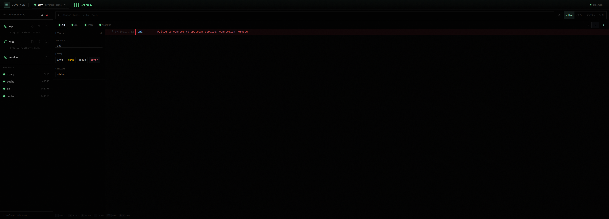

# devstack dashboard

A real-time web UI for monitoring and operating devstack runs. Open it with `devstack ui` (default: http://localhost:47832).

## Overview

The dashboard connects to the devstack daemon API over HTTP and provides a single-page view of all active runs, services, and logs. It polls for updates automatically — no manual refresh needed.

## Layout

The UI has three main areas:

### Header

- **Run selector** — dropdown showing all active and recent runs. Click to switch between runs. Shows stack name, project name, and a health bar.
- **Health summary** — colored bars indicating per-service state at a glance (green = ready, amber = starting, red = failed).
- **Daemon status** — connection indicator in the top-right. Shows a warning banner if the daemon is unreachable.

### Service Panel (left sidebar)

Lists every service in the current run with its state:

- Click a service to filter logs to that service.
- **Copy URL** — copies the service's allocated URL to clipboard.
- **Open** — opens the service URL in a new browser tab.
- **Restart** — restarts an individual service without affecting others.
- **Stop / Kill** — buttons at the top of the panel to stop or force-kill the entire stack.
- **Globals** — shared services (databases, caches) appear in a separate section at the bottom.

On mobile, the service panel is a slide-over drawer toggled from the header menu button.

### Log Viewer (main area)

Full-text searchable, virtualized log viewer with real-time streaming.

**Tabs** — switch between "All" (interleaved logs from every service) or individual service tabs. Keyboard shortcut: number keys `1`–`9`.

**Search** — full-text search powered by Tantivy. Type to filter; results update in real-time.
- Plain terms are auto-wrapped for the query engine.
- Facet filters like `service:api` or `level:error` narrow results to specific fields.
- Toggle the regex button for raw Tantivy query syntax (boolean operators, phrase queries).
- Search suggestions appear as you type, showing available facet fields and values with counts.
- Navigate matches with `⌘G` / `Shift+⌘G` or the up/down chevrons.

**Facets panel** — toggle with the filter icon (or press `F`). Shows field value counts (service, level, stream, and any indexed fields). Click a value to toggle it as a filter.



**Time range** — switch between Live (streaming), 5m, 15m, or 1h windows.

**Auto-scroll** — when scrolled to the bottom, new logs stream in automatically. Scroll up to pause; a "new logs" indicator appears with a count. Click the arrow button to jump back to the latest.

**Log rows** — each row shows timestamp, service label (color-coded), and message. Click a row to expand it and see the full JSON payload with all fields. Error and warn lines are highlighted.

**Share** — if a devstack agent session is active, a Share button appears that sends the current log query to the agent's terminal as a runnable `devstack show` command.

## Keyboard Shortcuts

| Key | Action |
|-----|--------|
| `/` or `Ctrl+F` | Focus search |
| `Escape` | Clear search / unfocus |
| `E` | Toggle error filter |
| `W` | Toggle warn filter |
| `F` | Toggle facets panel |
| `1`–`9` | Switch service tab (1 = All) |
| `⌘G` / `Ctrl+G` | Next search match |
| `Shift+⌘G` | Previous search match |
| `⌘K` | Open command palette |

## Command Palette

Press `⌘K` (or `Ctrl+K`) to open the command palette. It provides quick access to all dashboard actions: switching services, toggling filters, focusing search, copying the current URL, and more. Type to fuzzy-filter commands.

## URL State

All view state is reflected in URL query parameters:

| Param | Description |
|-------|-------------|
| `run` | Selected run ID |
| `service` | Active service tab |
| `search` | Search query |
| `level` | Level filter (`warn`, `error`) |
| `stream` | Stream filter (`stdout`, `stderr`) |
| `since` | Time range (`5m`, `15m`, `1h`, or ISO timestamp) |
| `last` | Number of log lines |

This means dashboard views are shareable and bookmarkable. Pasting a URL with parameters opens the dashboard with those exact filters applied.

## Navigation Intents

The `devstack show` CLI command sends a navigation intent to the daemon, which the dashboard picks up on its next poll. The intent sets URL parameters (run, service, search, level, etc.) and the dashboard navigates to that view automatically. This is how agents and scripts can drive the dashboard programmatically.

## Empty State

When no stacks are running, the dashboard shows registered projects with their available stacks. Click a stack to start it directly from the UI — no terminal needed.

## Tech Stack

- React with TypeScript
- TanStack Query for data fetching and polling
- TanStack Virtual for virtualized log rendering
- Framer Motion for animations
- shadcn/ui components with Tailwind CSS
- Vite for dev server and builds

## Development

```bash
cd devstack-dash
pnpm install
pnpm dev          # dev server with hot reload
pnpm build        # production build
pnpm test         # run tests
```

The dev server proxies API requests to the devstack daemon. In production, the daemon serves the built dashboard assets directly.
